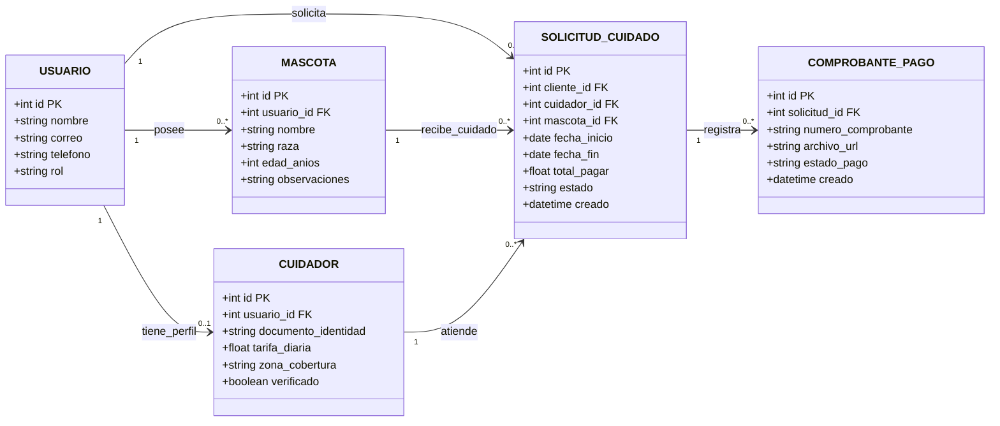
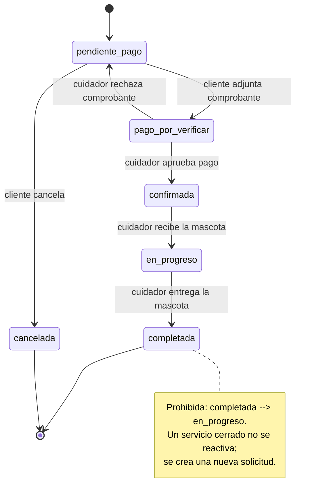

# Hito 1 · Ficha del negocio: Patafiel

**Pareja:** Jonathan Delgado · Colon Moreira  
**Paralelo:** Aplicaciones Web I B  
**Negocio en una línea:** Patafiel es una plataforma web ecuatoriana para gestionar la contratación de cuidadores verificados de perros, registrar el pago del servicio y dar seguimiento a cada solicitud de cuidado hasta la entrega de la mascota.

## 1. Negocio de referencia

El negocio de referencia es **Hands N Paws**, presentado en Starter Story por su fundador, Benny DiFranco. La empresa ofrece servicios presenciales de cuidado de mascotas y paseo de perros para personas que necesitan apoyo mientras trabajan, viajan o no pueden atender personalmente a sus animales. Su operación se apoya en una plataforma digital para registrar clientes, programar servicios, gestionar al personal y mantener la comunicación con los propietarios.

El modelo cobra **por cada servicio contratado**, con tarifas que varían según la duración de la visita o paseo. En el caso original publicado por Starter Story en 2020, el negocio fue presentado como una empresa que generaba aproximadamente **USD 8.000 mensuales**. El caso resulta útil para Patafiel porque demuestra que el cuidado de mascotas no depende únicamente del cuidador: también requiere organización de solicitudes, perfiles de clientes y mascotas, programación, pagos y seguimiento del servicio.

**Enlace (Starter Story):** https://www.starterstory.com/how-to-start-pet-care-service  

## 2. Caso de contraste

Un caso comparable es **DogVacay**, plataforma de cuidado de mascotas que compitió directamente con Rover y terminó siendo adquirida por esta empresa en 2017. Ambas plataformas funcionaban como marketplaces para conectar propietarios con cuidadores y obtenían alrededor de un 20 % de las reservas. De acuerdo con TechCrunch, los dos negocios sumaron aproximadamente USD 150 millones en reservas durante 2016, pero todavía no eran rentables al momento de la operación. Posteriormente, DogVacay dejó de operar como plataforma independiente y sus usuarios fueron migrados a Rover.

Nuestra hipótesis es que el principal riesgo estaba en la **economía de escala del marketplace**: sostener tecnología, soporte, captación de clientes y una red suficiente de cuidadores exige un volumen alto y recurrente de reservas. Si la plataforma no alcanza ese volumen, la comisión por servicio puede no cubrir sus costos. Para Patafiel, esto implica comenzar con un alcance controlado, procesos simples y una estructura operativa que pueda crecer conforme aumenten las solicitudes.

**Fuente:** https://techcrunch.com/2017/03/29/rover-dogvacay-merge/

## 3. Adaptación al Ecuador

1. **Uso de transferencias electrónicas como medio de pago.**  
   En Ecuador las transferencias electrónicas tienen un uso significativo; por ello, la primera versión de Patafiel permitirá registrar una transferencia y adjuntar su comprobante, en lugar de depender de una pasarela de tarjetas desde el inicio.  
   **Efecto en el negocio:** una solicitud no puede considerarse confirmada hasta que el pago haya sido revisado.  
   **Cambio en el modelo:** se incorporó la entidad `ComprobantePago` y el estado `pago_por_verificar` en `SolicitudDeCuidado`.

2. **El servicio depende de una zona física de cobertura.**  
   El cuidado canino se presta de forma presencial, por lo que un cuidador no puede atender solicitudes ubicadas fuera de las zonas en las que realmente puede desplazarse y trabajar.  
   **Efecto en el negocio:** antes de asignar o contratar a un cuidador, Patafiel debe comprobar que pueda atender el sector requerido por el cliente.  
   **Cambio en el modelo:** se agregó `zona_cobertura` al perfil de `Cuidador`.

3. **La finalización requiere la entrega real de la mascota.**  
   La fecha prevista de fin puede no coincidir exactamente con la devolución del perro por retrasos o cambios del propietario.  
   **Efecto en el negocio:** Patafiel no debe cerrar automáticamente la solicitud únicamente porque llegó la fecha de finalización.  
   **Cambio en el modelo:** el paso a `completada` se realiza mediante una acción explícita del cuidador después de entregar la mascota al propietario.

**Qué cambió en el modelo por estas restricciones:** La restricción 1 agregó `ComprobantePago` y el estado `pago_por_verificar`; la restricción 2 agregó `zona_cobertura` al cuidador; y la restricción 3 hizo que `completada` sea una transición explícita y no automática por fecha.

**Fuentes de apoyo sobre el contexto ecuatoriano:**  
- Banco Central del Ecuador, medios de pago electrónicos: https://www.bce.fin.ec/el-numero-de-operaciones-con-medios-de-pago-electronicos-se-triplico-entre-2019-y-2023/  
- Servicio de Rentas Internas, facturación electrónica: https://www.sri.gob.ec/facturacion-electronica

## 4. Modelo de datos

### Entidad: Usuario

| Atributo | Tipo | Obligatorio | Ejemplo |
|----------|------|-------------|---------|
| id | número entero | sí | 1 |
| nombre | texto | sí | Jonathan Delgado |
| correo | texto | sí | jonathan@ejemplo.com |
| telefono | texto | sí | 0991234567 |
| rol | uno de: cliente, cuidador | sí | cliente |

### Entidad: Mascota

| Atributo | Tipo | Obligatorio | Ejemplo |
|----------|------|-------------|---------|
| id | número entero | sí | 101 |
| usuario_id | referencia a otra entidad | sí | 1 (Usuario) |
| nombre | texto | sí | Tommy |
| raza | texto | sí | Labrador |
| edad_anios | número entero | sí | 3 |
| observaciones | texto | no | Alérgico a ciertos alimentos |

### Entidad: Cuidador

| Atributo | Tipo | Obligatorio | Ejemplo |
|----------|------|-------------|---------|
| id | número entero | sí | 50 |
| usuario_id | referencia a otra entidad | sí | 2 (Usuario) |
| documento_identidad | texto | sí | 1312345678 |
| tarifa_diaria | número decimal | sí | 15.50 |
| zona_cobertura | texto | sí | Norte de la ciudad |
| verificado | sí/no | sí | sí |

### Entidad: SolicitudDeCuidado

| Atributo | Tipo | Obligatorio | Ejemplo |
|----------|------|-------------|---------|
| id | número entero | sí | 5001 |
| cliente_id | referencia a otra entidad | sí | 1 (Usuario) |
| cuidador_id | referencia a otra entidad | sí | 50 (Cuidador) |
| mascota_id | referencia a otra entidad | sí | 101 (Mascota) |
| fecha_inicio | fecha | sí | 03-10-2026 |
| fecha_fin | fecha | sí | 05-10-2026 |
| total_pagar | número decimal | sí | 46.50 |
| estado | uno de: pendiente_pago, pago_por_verificar, confirmada, en_progreso, completada, cancelada | sí | pendiente_pago |
| creado | fecha y hora | sí | 30-09-2026 14:00 |

### Entidad: ComprobantePago

| Atributo | Tipo | Obligatorio | Ejemplo |
|----------|------|-------------|---------|
| id | número entero | sí | 901 |
| solicitud_id | referencia a otra entidad | sí | 5001 (SolicitudDeCuidado) |
| numero_comprobante | texto | sí | 001928374 |
| archivo_url | texto | sí | /comprobantes/c1.webp |
| estado_pago | uno de: pendiente, aprobado, rechazado | sí | pendiente |
| creado | fecha y hora | sí | 30-09-2026 14:10 |

### Relaciones

| Entidades | Cardinalidad | Frase |
|-----------|--------------|-------|
| Usuario — Mascota | 1—N | Un cliente puede registrar muchas mascotas; cada mascota pertenece a un solo usuario. |
| Usuario — Cuidador | 1—0..1 | Un usuario puede no ser cuidador o tener un único perfil de cuidador. |
| Usuario — SolicitudDeCuidado | 1—N | Un cliente puede crear muchas solicitudes; cada solicitud pertenece a un solo cliente. |
| Mascota — SolicitudDeCuidado | 1—N | Una mascota puede aparecer en muchas solicitudes a lo largo del tiempo; cada solicitud corresponde a una sola mascota. |
| Cuidador — SolicitudDeCuidado | 1—N | Un cuidador puede atender muchas solicitudes; cada solicitud está asignada a un solo cuidador. |
| SolicitudDeCuidado — ComprobantePago | 1—N | Una solicitud puede tener varios comprobantes si alguno fue rechazado; cada comprobante pertenece a una sola solicitud. |

### Diagrama del modelo completo

**Decisión discutible del modelo y por qué la tomamos:** `ComprobantePago` se modeló como entidad independiente y con relación 1—N respecto a `SolicitudDeCuidado`, porque un comprobante puede ser rechazado y el cliente debe poder cargar otro sin borrar el anterior. Así se conserva el historial de intentos de pago y se evita sobrescribir evidencia.

## 5. Máquina de estados

**Entidad con estados:** `SolicitudDeCuidado`

| Estado | Qué significa |
|--------|---------------|
| pendiente_pago (inicial) | La solicitud fue creada y todavía no tiene un comprobante de transferencia pendiente de revisión. |
| pago_por_verificar | El cliente adjuntó un comprobante y el pago está siendo revisado. |
| confirmada | El pago fue aceptado y el servicio quedó reservado con el cuidador. |
| en_progreso | El cuidador recibió a la mascota y el servicio se está ejecutando. |
| completada | El servicio terminó y la mascota fue entregada nuevamente al propietario. |
| cancelada | El cliente anuló la solicitud antes de que el servicio fuera confirmado. |

| De | A | Quién la hace | Condición |
|----|---|---------------|-----------|
| pendiente_pago | pago_por_verificar | cliente | Adjunta un nuevo comprobante de transferencia. |
| pago_por_verificar | confirmada | cuidador | Verifica que el pago corresponde a la solicitud y lo aprueba. |
| pago_por_verificar | pendiente_pago | cuidador | Rechaza el comprobante por monto o información incorrecta; el cliente puede cargar otro. |
| confirmada | en_progreso | cuidador | Recibe físicamente a la mascota en la fecha acordada. |
| en_progreso | completada | cuidador | Finaliza el cuidado y entrega la mascota al propietario. |
| pendiente_pago | cancelada | cliente | Decide no continuar antes de que el pago sea confirmado. |

**Transición prohibida y por qué:** `completada → en_progreso` está prohibida porque un servicio finalizado forma parte del historial y no debe reactivarse. Si el propietario necesita más días o un nuevo cuidado, debe crear otra solicitud, lo que mantiene separados el cobro, las fechas y el seguimiento de cada servicio.

### Diagrama de estados

## 6. Roles y permisos

| Acción | Cliente (dueño) | Cuidador |
|--------|------------------|----------|
| Ver solicitudes de cuidado | solo las suyas | solo las suyas |
| Crear solicitud de cuidado | sí | no |
| Registrar o editar sus mascotas | solo las suyas | no |
| Subir comprobante de pago | solo las suyas | no |
| Aprobar o rechazar comprobante | no | solo las suyas |
| Cambiar a `en_progreso` | no | solo las suyas |
| Cambiar a `completada` | no | solo las suyas |
| Cancelar antes de la confirmación | solo las suyas | no |

En el caso del cuidador, **“solo las suyas”** significa únicamente las solicitudes que están asignadas a su perfil; no puede consultar ni modificar solicitudes de otros cuidadores.

## 7. Mapa de vistas por rol

| Vista | Rol | Qué datos muestra | Acciones | Cómo se ve el estado |
|-------|-----|-------------------|----------|----------------------|
| Solicitudes de cuidado | Cliente | Mascota, cuidador, fechas, total y estado | Ver detalle, adjuntar comprobante, cancelar si aplica | Texto visible: `Pendiente de pago`, `Pago por verificar`, `Confirmada`, etc. |
| Nueva solicitud | Cliente | Mascota, cuidador, fecha de inicio, fecha de fin y observaciones | Crear solicitud | Al guardar se muestra `Pendiente de pago` como texto. |
| Detalles de la solicitud | Cliente | Datos completos de la reserva, comprobantes y datos del cuidador | Adjuntar nuevo comprobante cuando corresponda | Estado escrito en texto junto al resumen de la solicitud. |
| Solicitudes asignadas | Cuidador | Cliente, mascota, fechas, pago y estado | Abrir detalle, revisar solicitudes asignadas | El listado muestra el estado como palabra; el color solo acompaña. |
| Gestión de solicitud | Cuidador | Mascota, instrucciones, comprobantes, fechas y total | Aprobar/rechazar pago, iniciar cuidado, completar servicio | Estado actual escrito en texto y acciones habilitadas según ese estado. |

**Vistas ya maquetadas en el repositorio y en qué archivo:**  
- `Listado de solicitudes recibidas`: `src/App.svelte`.  
- `Formulario de nueva solicitud`: `src/Formulario.svelte`.  

## 8. Declaración de IA
Gemini se utilizó inicialmente para apoyar la estructuración de la ficha. ChatGPT se utilizó posteriormente para revisar la coherencia entre el negocio, el modelo de datos, las cardinalidades, la máquina de estados, los roles y el mapa de vistas. Las redacciones finales se verificaron personalmente.
